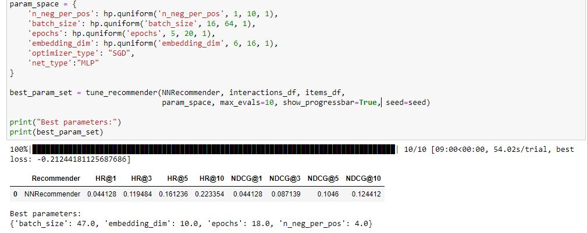
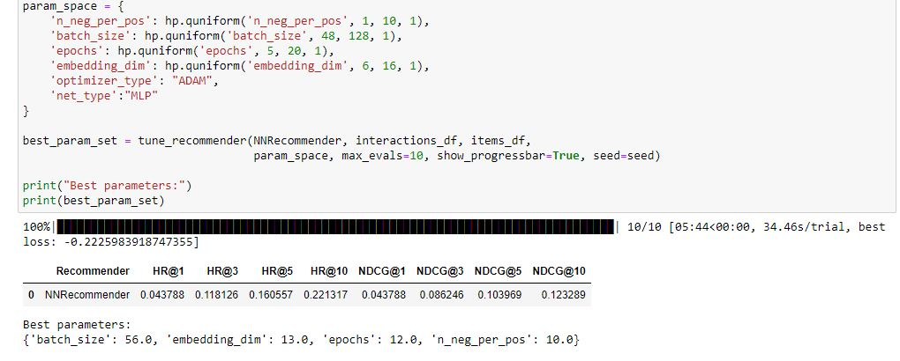
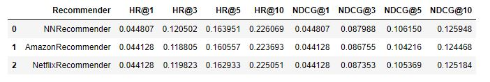

# Recommender systems class project 2: Neural network recommender

## Project description

The aim of the project was to create a recommender based on neural network. Data in this piece of work
comes from real hotel booking data. Based on data prepared previously in [project #1](https://github.com/e-lawniczak/rsc-project1.git)
I results of my recommender will be compared with recommenders that implement algorithms used in netflix and amazon.

### Data preparation

Hotel data was prepared and mapped into buckets resulting in 25 features per item.
Netflix and Amazon recommenders use item representation therefore I'm using one-hot encoded array of item representation.
Aside from items available, most important data set in this projects are interactions. They contain information about users and items they booked in real life.
I'll try to train my neural network based on this interactions.

### Tuning
I prepared the recommender, tuned and tested it with diffrent configurations.
Optimization algorythms used are from torch.optim package

| lp | Network model                                                         | Optimization algorithm |
|----|-----------------------------------------------------------------------|------------------------|
| 1  | Multi-Layer Perceptron (MLP)                                          | SGD                    |
| 2  | Multi-Layer Perceptron (MLP)                                          | Adam                   |
| 3  | Multi-Layer Perceptron (MLP) + Generalized Matrix Factorization (GMF) | Adam                   |
| 4  | Generalized Matrix Factorization (GMF)                                | Adam                   |
| 5  | All models                                                            | both algorithms        |

For tuning I tried diffrent variable spaces in hyperopt tool. With varrying n_neg_per_pos, batch_size, epochs, embedding_dim values.

Hyperopt optimalization attempts (in order from table)
#### 1

#### 2

#### 3

#### 4

#### 5

### Final evaluation

I picked the best variant and 

#### Amazon recommender vs. Netflix recommender vs. My Recommender

### Requirements to run the notebooks

1. Install jupyter
    <!-- -->

        pip install jupyter

    
2. Install required python libraries: numpy, pandas, matplotlib, seaboen, IPython.display, sklearn, hyperopt, torch, torch.nn, torch.optim
     <!-- -->

        pip install <name_of_the_package>

   Alternatively if you have Anaconda installed, you can configure enviorment using conda
    <!-- -->
       
        conda env create --name rs-class-env -f environment.yml
        conda activate rs-class-env

3. While in working directory type
         <!-- -->

        jupyter notebook

In git bash or terminal

4. From there you can look trough all files especially
- project_1_data_preparation.ipynb
- project_1_recommender_and_evaluation.ipynb
- data_preprocessing_toolkit.py

These contain majority of code responsible for whole project. You can also run code for yourself from this view.

